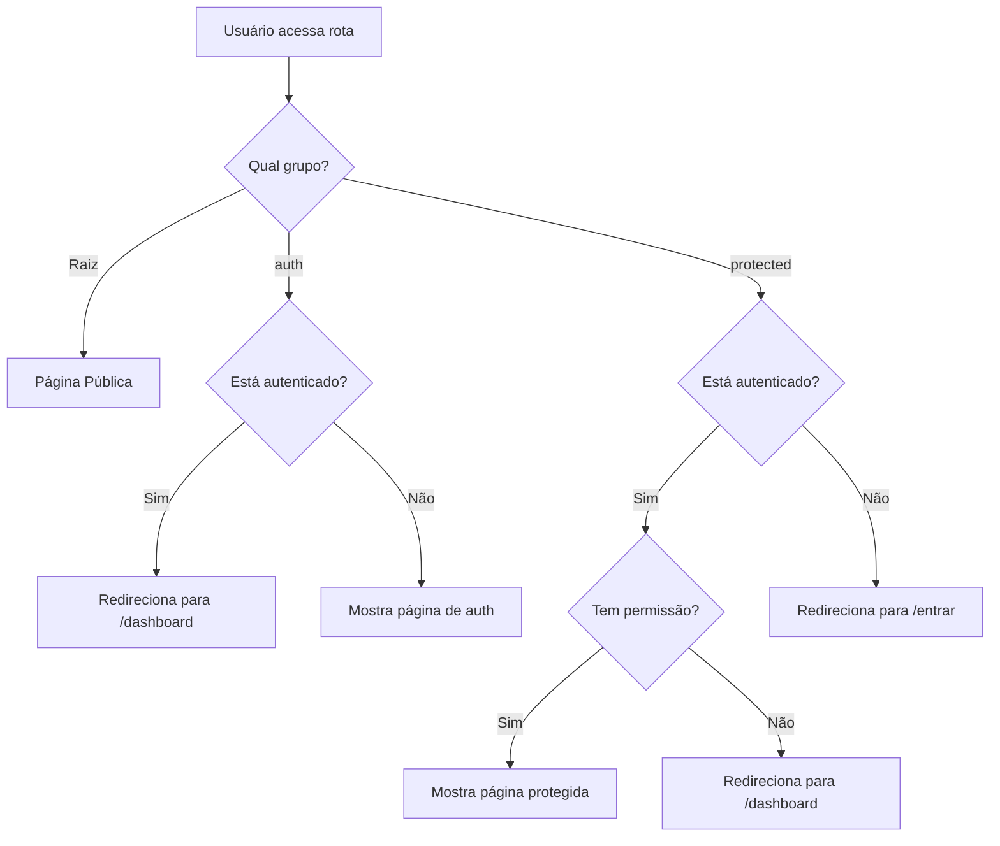

# Vite Starter Pack

Um boilerplate completo para iniciar novos projetos React com autenticação, sistema de permissões e componentes UI prontos para uso.

## Recursos Incluídos

- **Autenticação JWT** com refresh token automático
- **Sistema de Permissões (RBAC)** com guards de rotas
- **Componentes UI** baseados em shadcn/ui + Radix UI
- **TanStack Router** para roteamento file-based
- **TanStack Query** para data fetching
- **Zustand** para gerenciamento de estado
- **React Hook Form + Zod** para formulários e validação
- **Laravel Echo** para WebSockets (opcional)
- **Orval** para geração de API client a partir de OpenAPI
- **Tailwind CSS v4** para estilização
- **Biome** para linting e formatação
- **Vitest** para testes
- **Docker** pronto para deploy

## Começando

### 1. Instalar dependências

```bash
pnpm install
```

### 2. Configurar variáveis de ambiente

```bash
cp .env.example .env
```

Edite o arquivo `.env` com suas configurações:

```env
VITE_APP_NAME="Meu App"
VITE_API_BASE_URL="http://localhost:8000"
VITE_API_SWAGGER_URL="http://localhost:8000/api/documentation"
VITE_TOKEN_STORAGE_KEY="auth_token"
VITE_REFRESH_TOKEN_STORAGE_KEY="refresh_token"
```

### 3. Gerar API Client (opcional)

Se sua API possui documentação Swagger/OpenAPI:

```bash
# Configure a URL no orval.config.ts
pnpm generate:api
```

### 4. Iniciar o servidor de desenvolvimento

```bash
pnpm dev
```

## Estrutura do Projeto

```
src/
├── api/                    # Integrações de API
│   ├── brasil-api/        # API externa (CEP)
│   └── generated/         # Código gerado pelo Orval
├── components/
│   ├── auth/              # Formulários de autenticação
│   ├── layout/            # Layout (sidebar, header, etc.)
│   ├── settings/          # Configurações do usuário
│   └── ui/                # Componentes shadcn/ui
├── config/
│   └── navigation.ts      # Configuração do menu
├── hooks/                 # Custom hooks
├── lib/                   # Utilitários core
│   ├── api-client.ts      # Cliente Axios com interceptors
│   ├── auth.ts            # Gerenciamento de tokens
│   ├── echo-client.ts     # Cliente WebSocket
│   └── permissions.ts     # Utilitários de permissões
├── providers/             # Context providers
├── routes/                # Rotas (file-based)
│   ├── (auth)/            # Rotas de autenticação
│   └── (protected)/       # Rotas protegidas
├── schemas/               # Schemas Zod
├── stores/                # Zustand stores
├── types/                 # Definições TypeScript
└── utils/                 # Utilitários gerais
```

## Autenticação

O sistema de autenticação utiliza JWT com refresh automático:

```tsx
import { useAuthStore } from "@/stores/auth-store";

// No componente
const { user, isAuthenticated, signIn, signOut } = useAuthStore();

// Login
await signIn(email, password, rememberMe);

// Logout
signOut();
```

## Permissões

O sistema suporta permissões granulares:

```tsx
import { usePermissions } from "@/hooks/use-permissions";
import { PermissionGuard } from "@/providers/permissions-provider";

// Hook
const { hasPermission, hasAnyPermission } = usePermissions();

if (hasPermission("users.create")) {
  // ...
}

// Componente Guard
<PermissionGuard permission="users.delete">
  <Button>Deletar</Button>
</PermissionGuard>
```

### Proteger rotas

```tsx
// Em src/routes/(protected)/minha-rota.tsx
export const Route = createFileRoute("/(protected)/minha-rota")({
  staticData: {
    requiredPermissions: ["minha-feature.view"],
  },
  beforeLoad: async () => {
    await ensureAuthenticated();
    ensureRoutePermissions({ requiredPermissions: ["minha-feature.view"] });
  },
  component: MinhaRotaPage,
});
```

## Criando Novas Páginas

O projeto utiliza TanStack Router com roteamento baseado em arquivos. A estrutura de pastas define o comportamento de autenticação:

```
src/routes/
├── __root.tsx           # Layout raiz (providers globais)
├── sobre.tsx            # Página pública (/sobre)
├── (auth)/              # Grupo: páginas de autenticação
│   ├── layout.tsx       # Redireciona usuários já autenticados
│   ├── index.tsx        # /entrar (login)
│   ├── recuperar-senha.tsx
│   └── redefinir-senha.tsx
└── (protected)/         # Grupo: páginas privadas
    ├── layout.tsx       # Requer autenticação
    ├── dashboard.tsx    # /dashboard
    └── configuracoes/   # Subpastas criam rotas aninhadas
```

### Tipos de Rotas

| Local | Tipo | Comportamento |
|-------|------|---------------|
| `src/routes/` (raiz) | Pública | Acessível por qualquer visitante |
| `src/routes/(auth)/` | Autenticação | Redireciona para `/dashboard` se já logado |
| `src/routes/(protected)/` | Privada | Redireciona para `/entrar` se não logado |

### Fluxo de Decisão



### Criar Página Pública

Crie o arquivo diretamente em `src/routes/`:

```tsx
// src/routes/sobre.tsx
import { createFileRoute } from "@tanstack/react-router";

export const Route = createFileRoute("/sobre")({
  component: SobrePage,
});

function SobrePage() {
  return (
    <div className="container mx-auto py-8">
      <h1 className="text-3xl font-bold">Sobre Nós</h1>
      <p className="mt-4 text-muted-foreground">
        Página pública acessível por qualquer visitante.
      </p>
    </div>
  );
}
```

### Criar Página Privada (Protegida)

Crie o arquivo em `src/routes/(protected)/`:

```tsx
// src/routes/(protected)/usuarios.tsx
import { createFileRoute } from "@tanstack/react-router";
import { ensureAuthenticated, ensureRoutePermissions } from "@/utils/route-guards";

export const Route = createFileRoute("/(protected)/usuarios")({
  // Opcional: definir permissões necessárias
  staticData: {
    requiredPermissions: ["users.view"],
  },
  beforeLoad: async () => {
    await ensureAuthenticated();
    // Opcional: verificar permissões específicas
    ensureRoutePermissions({ requiredPermissions: ["users.view"] });
  },
  component: UsuariosPage,
});

function UsuariosPage() {
  return (
    <div>
      <h1 className="text-2xl font-bold">Usuários</h1>
      {/* Conteúdo da página */}
    </div>
  );
}
```

**Nota:** Se sua página não requer permissões específicas, apenas autenticação, você pode omitir `staticData` e `ensureRoutePermissions`:

```tsx
export const Route = createFileRoute("/(protected)/minha-pagina")({
  beforeLoad: async () => {
    await ensureAuthenticated();
  },
  component: MinhaPaginaPage,
});
```

### Adicionar ao Menu de Navegação

Após criar a rota, adicione-a ao menu em `src/config/navigation.ts`:

```tsx
import { UsersIcon } from "lucide-react";

export const mainNavItems: NavItem[] = [
  // ...itens existentes
  {
    title: "Usuários",
    href: "/usuarios",
    icon: UsersIcon,
    permissions: ["users.view"], // Opcional: esconde se não tiver permissão
  },
];
```

### Criar Subpastas (Rotas Aninhadas)

Para organizar rotas relacionadas, crie subpastas:

```
src/routes/(protected)/usuarios/
├── index.tsx           # /usuarios (lista)
├── criar.tsx           # /usuarios/criar
└── [id].tsx            # /usuarios/:id (dinâmico)
```

Exemplo de rota dinâmica:

```tsx
// src/routes/(protected)/usuarios/[id].tsx
import { createFileRoute } from "@tanstack/react-router";

export const Route = createFileRoute("/(protected)/usuarios/$id")({
  component: UsuarioDetalhePage,
});

function UsuarioDetalhePage() {
  const { id } = Route.useParams();
  return <div>Detalhes do usuário {id}</div>;
}
```

## Criando um CRUD Completo

Este guia mostra como criar um módulo CRUD completo com listagem (DataTable), formulários e integração com API.

### Estrutura de Pastas

```
src/
├── api/
│   └── generated/                # Hooks gerados pelo Orval
│       └── usuarios/
│           └── usuarios.ts       # useGetUsuarios, useCreateUsuario, etc.
├── components/
│   └── usuarios/
│       ├── columns.tsx           # Definição das colunas (puro, sem API)
│       ├── data-table.tsx        # Componente DataTable (puro, sem API)
│       ├── table-actions.tsx     # Ações da linha (recebe callbacks)
│       ├── usuario-form.tsx      # Formulário (puro, sem API)
│       └── usuario-dialog.tsx    # Dialog + Form + Mutations (conecta API)
├── schemas/
│   └── usuario.ts                # Schema Zod
└── routes/
    └── (protected)/
        └── usuarios/
            ├── index.tsx         # Listagem + Query (conecta API)
            └── criar.tsx         # Página + Mutation (conecta API)
```

**Princípio de Separação**:
- **Componentes puros** (`form`, `columns`, `data-table`): Recebem dados via props, sem chamadas API
- **Containers** (`dialog`, `pages`): Conectam API, gerenciam mutations e passam dados para componentes puros

### 1. Schema Zod

```tsx
// src/schemas/usuario.ts
import { z } from "zod";

export const usuarioSchema = z.object({
  nome: z.string().min(1, "Nome é obrigatório"),
  email: z.string().email("E-mail inválido"),
  cargo: z.string().optional(),
});

export type IUsuario = z.infer<typeof usuarioSchema>;
```

### 2. Definição de Colunas

```tsx
// src/components/usuarios/columns.tsx
import type { ColumnDef } from "@tanstack/react-table";
import { TableActions } from "./table-actions";

export type Usuario = {
  id: number;
  nome: string;
  email: string;
  created_at: string;
};

export const columns: ColumnDef<Usuario>[] = [
  {
    accessorKey: "nome",
    header: "Nome",
  },
  {
    accessorKey: "email",
    header: "E-mail",
  },
  {
    accessorKey: "created_at",
    header: "Criado em",
    cell: ({ row }) => {
      return new Date(row.getValue("created_at")).toLocaleDateString("pt-BR");
    },
  },
  {
    id: "actions",
    cell: ({ row }) => <TableActions usuario={row.original} />,
  },
];
```

### 3. Componente DataTable

```tsx
// src/components/usuarios/data-table.tsx
import {
  type ColumnDef,
  flexRender,
  getCoreRowModel,
  getPaginationRowModel,
  getSortedRowModel,
  getFilteredRowModel,
  useReactTable,
  type SortingState,
  type ColumnFiltersState,
} from "@tanstack/react-table";
import * as React from "react";

import { Button } from "@/components/ui/button";
import { Input } from "@/components/ui/input";
import {
  Table,
  TableBody,
  TableCell,
  TableHead,
  TableHeader,
  TableRow,
} from "@/components/ui/table";

interface DataTableProps<TData, TValue> {
  columns: ColumnDef<TData, TValue>[];
  data: TData[];
}

export function DataTable<TData, TValue>({
  columns,
  data,
}: DataTableProps<TData, TValue>) {
  const [sorting, setSorting] = React.useState<SortingState>([]);
  const [columnFilters, setColumnFilters] = React.useState<ColumnFiltersState>([]);

  const table = useReactTable({
    data,
    columns,
    getCoreRowModel: getCoreRowModel(),
    getPaginationRowModel: getPaginationRowModel(),
    onSortingChange: setSorting,
    getSortedRowModel: getSortedRowModel(),
    onColumnFiltersChange: setColumnFilters,
    getFilteredRowModel: getFilteredRowModel(),
    state: { sorting, columnFilters },
  });

  return (
    <div className="space-y-4">
      <Input
        placeholder="Filtrar por nome..."
        value={(table.getColumn("nome")?.getFilterValue() as string) ?? ""}
        onChange={(event) =>
          table.getColumn("nome")?.setFilterValue(event.target.value)
        }
        className="max-w-sm"
      />

      <div className="rounded-md border">
        <Table>
          <TableHeader>
            {table.getHeaderGroups().map((headerGroup) => (
              <TableRow key={headerGroup.id}>
                {headerGroup.headers.map((header) => (
                  <TableHead key={header.id}>
                    {header.isPlaceholder
                      ? null
                      : flexRender(header.column.columnDef.header, header.getContext())}
                  </TableHead>
                ))}
              </TableRow>
            ))}
          </TableHeader>
          <TableBody>
            {table.getRowModel().rows?.length ? (
              table.getRowModel().rows.map((row) => (
                <TableRow key={row.id}>
                  {row.getVisibleCells().map((cell) => (
                    <TableCell key={cell.id}>
                      {flexRender(cell.column.columnDef.cell, cell.getContext())}
                    </TableCell>
                  ))}
                </TableRow>
              ))
            ) : (
              <TableRow>
                <TableCell colSpan={columns.length} className="h-24 text-center">
                  Nenhum resultado encontrado.
                </TableCell>
              </TableRow>
            )}
          </TableBody>
        </Table>
      </div>

      <div className="flex items-center justify-end space-x-2">
        <Button
          variant="outline"
          size="sm"
          onClick={() => table.previousPage()}
          disabled={!table.getCanPreviousPage()}
        >
          Anterior
        </Button>
        <Button
          variant="outline"
          size="sm"
          onClick={() => table.nextPage()}
          disabled={!table.getCanNextPage()}
        >
          Próximo
        </Button>
      </div>
    </div>
  );
}
```

### 4. Formulário Reutilizável

O formulário é um componente **puro** - recebe `onSubmit` e `isSubmitting` via props:

```tsx
// src/components/usuarios/usuario-form.tsx
import { zodResolver } from "@hookform/resolvers/zod";
import * as React from "react";
import { Controller, useForm } from "react-hook-form";

import { Button } from "@/components/ui/button";
import {
  Field,
  FieldContent,
  FieldError,
  FieldGroup,
  FieldLabel,
} from "@/components/ui/field";
import { Input } from "@/components/ui/input";
import { Spinner } from "@/components/ui/spinner";
import { type IUsuario, usuarioSchema } from "@/schemas/usuario";

interface UsuarioFormProps {
  defaultValues?: Partial<IUsuario>;
  onSubmit: (data: IUsuario) => Promise<void>;
  isSubmitting: boolean;
}

export function UsuarioForm({ defaultValues, onSubmit, isSubmitting }: UsuarioFormProps) {
  const nomeId = React.useId();
  const emailId = React.useId();
  const cargoId = React.useId();

  const form = useForm<IUsuario>({
    resolver: zodResolver(usuarioSchema),
    defaultValues: {
      nome: defaultValues?.nome ?? "",
      email: defaultValues?.email ?? "",
      cargo: defaultValues?.cargo ?? "",
    },
  });

  return (
    <form onSubmit={form.handleSubmit(onSubmit)} className="space-y-6">
      <FieldGroup>
        <Controller
          control={form.control}
          name="nome"
          render={({ field, fieldState }) => (
            <Field>
              <FieldLabel htmlFor={nomeId} schema={usuarioSchema} fieldName="nome">
                Nome
              </FieldLabel>
              <FieldContent>
                <Input {...field} id={nomeId} />
                {fieldState.error && (
                  <FieldError>{fieldState.error.message}</FieldError>
                )}
              </FieldContent>
            </Field>
          )}
        />

        <Controller
          control={form.control}
          name="email"
          render={({ field, fieldState }) => (
            <Field>
              <FieldLabel htmlFor={emailId} schema={usuarioSchema} fieldName="email">
                E-mail
              </FieldLabel>
              <FieldContent>
                <Input {...field} id={emailId} type="email" />
                {fieldState.error && (
                  <FieldError>{fieldState.error.message}</FieldError>
                )}
              </FieldContent>
            </Field>
          )}
        />

        <Controller
          control={form.control}
          name="cargo"
          render={({ field, fieldState }) => (
            <Field>
              <FieldLabel htmlFor={cargoId} schema={usuarioSchema} fieldName="cargo">
                Cargo
              </FieldLabel>
              <FieldContent>
                <Input {...field} id={cargoId} />
                {fieldState.error && (
                  <FieldError>{fieldState.error.message}</FieldError>
                )}
              </FieldContent>
            </Field>
          )}
        />
      </FieldGroup>

      <Button type="submit" disabled={isSubmitting}>
        {isSubmitting ? (
          <>
            <Spinner />
            Salvando...
          </>
        ) : (
          "Salvar"
        )}
      </Button>
    </form>
  );
}
```

**Benefícios do `FieldLabel` com `schema`**:
- Detecta automaticamente se o campo é obrigatório via Zod
- Exibe asterisco (*) vermelho para campos required
- Evita duplicação de lógica de validação

### 5. Integração com API (Hooks Orval)

As mutations ficam nos **containers** (pages e dialogs), NÃO nos forms.

#### Página de Listagem (Query)

```tsx
// src/routes/(protected)/usuarios/index.tsx
import { createFileRoute } from "@tanstack/react-router";
import { useGetUsuarios } from "@/api/generated/usuarios/usuarios";
import { columns } from "@/components/usuarios/columns";
import { DataTable } from "@/components/usuarios/data-table";
import { Skeleton } from "@/components/ui/skeleton";
import { ensureAuthenticated } from "@/utils/route-guards";

export const Route = createFileRoute("/(protected)/usuarios/")({
  beforeLoad: async () => {
    await ensureAuthenticated();
  },
  component: UsuariosPage,
});

function UsuariosPage() {
  const { data, isLoading, isError } = useGetUsuarios({
    query: {
      staleTime: 1000 * 60 * 5, // 5 minutos
    },
  });

  if (isLoading) return <Skeleton className="h-96 w-full" />;
  if (isError) return <div>Erro ao carregar usuários</div>;

  return (
    <div className="space-y-4">
      <h1 className="text-2xl font-bold">Usuários</h1>
      <DataTable columns={columns} data={data?.data ?? []} />
    </div>
  );
}
```

#### Página de Criação (Mutation)

```tsx
// src/routes/(protected)/usuarios/criar.tsx
import { createFileRoute, useNavigate } from "@tanstack/react-router";
import { useQueryClient } from "@tanstack/react-query";
import { toast } from "sonner";
import { useCreateUsuario, getGetUsuariosQueryKey } from "@/api/generated/usuarios/usuarios";
import { UsuarioForm } from "@/components/usuarios/usuario-form";
import { onError } from "@/utils/on-error";
import { ensureAuthenticated } from "@/utils/route-guards";
import type { IUsuario } from "@/schemas/usuario";

export const Route = createFileRoute("/(protected)/usuarios/criar")({
  beforeLoad: async () => {
    await ensureAuthenticated();
  },
  component: CriarUsuarioPage,
});

function CriarUsuarioPage() {
  const navigate = useNavigate();
  const queryClient = useQueryClient();

  const { mutateAsync: createUsuario, isPending } = useCreateUsuario({
    mutation: {
      onSuccess: (response) => {
        toast.success(response.message ?? "Usuário criado com sucesso");
        queryClient.invalidateQueries({
          queryKey: getGetUsuariosQueryKey(),
        });
        navigate({ to: "/usuarios" });
      },
      onError,
    },
  });

  const handleSubmit = async (data: IUsuario) => {
    await createUsuario({ data });
  };

  return (
    <div className="space-y-4">
      <h1 className="text-2xl font-bold">Novo Usuário</h1>
      <UsuarioForm onSubmit={handleSubmit} isSubmitting={isPending} />
    </div>
  );
}
```

### 6. Dialog de Edição

```tsx
// src/components/usuarios/usuario-dialog.tsx
import { useQueryClient } from "@tanstack/react-query";
import { toast } from "sonner";
import {
  useUpdateUsuario,
  useCreateUsuario,
  getGetUsuariosQueryKey,
} from "@/api/generated/usuarios/usuarios";
import {
  Dialog,
  DialogContent,
  DialogHeader,
  DialogTitle,
} from "@/components/ui/dialog";
import { UsuarioForm } from "./usuario-form";
import { onError } from "@/utils/on-error";
import type { IUsuario } from "@/schemas/usuario";

interface UsuarioDialogProps {
  open: boolean;
  onOpenChange: (open: boolean) => void;
  usuario?: { id: number } & IUsuario; // undefined = criação, preenchido = edição
}

export function UsuarioDialog({ open, onOpenChange, usuario }: UsuarioDialogProps) {
  const queryClient = useQueryClient();
  const isEditing = !!usuario;

  const { mutateAsync: createUsuario, isPending: isPendingCreate } = useCreateUsuario({
    mutation: {
      onSuccess: (response) => {
        toast.success(response.message ?? "Usuário criado com sucesso");
        queryClient.invalidateQueries({ queryKey: getGetUsuariosQueryKey() });
        onOpenChange(false);
      },
      onError,
    },
  });

  const { mutateAsync: updateUsuario, isPending: isPendingUpdate } = useUpdateUsuario({
    mutation: {
      onSuccess: (response) => {
        toast.success(response.message ?? "Usuário atualizado com sucesso");
        queryClient.invalidateQueries({ queryKey: getGetUsuariosQueryKey() });
        onOpenChange(false);
      },
      onError,
    },
  });

  const isSubmitting = isPendingCreate || isPendingUpdate;

  const handleSubmit = async (data: IUsuario) => {
    if (isEditing) {
      await updateUsuario({ id: usuario.id, data });
    } else {
      await createUsuario({ data });
    }
  };

  return (
    <Dialog open={open} onOpenChange={onOpenChange}>
      <DialogContent>
        <DialogHeader>
          <DialogTitle>{isEditing ? "Editar" : "Novo"} Usuário</DialogTitle>
        </DialogHeader>
        <UsuarioForm
          defaultValues={usuario}
          onSubmit={handleSubmit}
          isSubmitting={isSubmitting}
        />
      </DialogContent>
    </Dialog>
  );
}
```

### 7. Ações da Tabela (Editar/Excluir)

```tsx
// src/components/usuarios/table-actions.tsx
import * as React from "react";
import { MoreHorizontal, Pencil, Trash2 } from "lucide-react";
import { useQueryClient } from "@tanstack/react-query";
import { toast } from "sonner";
import { useDeleteUsuario, getGetUsuariosQueryKey } from "@/api/generated/usuarios/usuarios";
import {
  AlertDialog,
  AlertDialogAction,
  AlertDialogCancel,
  AlertDialogContent,
  AlertDialogDescription,
  AlertDialogFooter,
  AlertDialogHeader,
  AlertDialogTitle,
} from "@/components/ui/alert-dialog";
import { Button } from "@/components/ui/button";
import {
  DropdownMenu,
  DropdownMenuContent,
  DropdownMenuItem,
  DropdownMenuTrigger,
} from "@/components/ui/dropdown-menu";
import { Spinner } from "@/components/ui/spinner";
import { UsuarioDialog } from "./usuario-dialog";
import { onError } from "@/utils/on-error";
import type { Usuario } from "./columns";

export function TableActions({ usuario }: { usuario: Usuario }) {
  const [showEditDialog, setShowEditDialog] = React.useState(false);
  const [showDeleteDialog, setShowDeleteDialog] = React.useState(false);
  const queryClient = useQueryClient();

  const { mutateAsync: deleteUsuario, isPending: isDeleting } = useDeleteUsuario({
    mutation: {
      onSuccess: () => {
        toast.success("Usuário excluído com sucesso");
        queryClient.invalidateQueries({ queryKey: getGetUsuariosQueryKey() });
        setShowDeleteDialog(false);
      },
      onError,
    },
  });

  const handleDelete = async () => {
    await deleteUsuario({ id: usuario.id });
  };

  return (
    <>
      <DropdownMenu>
        <DropdownMenuTrigger asChild>
          <Button variant="ghost" className="h-8 w-8 p-0">
            <span className="sr-only">Abrir menu</span>
            <MoreHorizontal className="h-4 w-4" />
          </Button>
        </DropdownMenuTrigger>
        <DropdownMenuContent align="end">
          <DropdownMenuItem onClick={() => setShowEditDialog(true)}>
            <Pencil className="mr-2 h-4 w-4" />
            Editar
          </DropdownMenuItem>
          <DropdownMenuItem
            onClick={() => setShowDeleteDialog(true)}
            className="text-destructive"
          >
            <Trash2 className="mr-2 h-4 w-4" />
            Excluir
          </DropdownMenuItem>
        </DropdownMenuContent>
      </DropdownMenu>

      <UsuarioDialog
        open={showEditDialog}
        onOpenChange={setShowEditDialog}
        usuario={usuario}
      />

      <AlertDialog open={showDeleteDialog} onOpenChange={setShowDeleteDialog}>
        <AlertDialogContent>
          <AlertDialogHeader>
            <AlertDialogTitle>Confirmar exclusão</AlertDialogTitle>
            <AlertDialogDescription>
              Tem certeza que deseja excluir "{usuario.nome}"? Esta ação não pode ser desfeita.
            </AlertDialogDescription>
          </AlertDialogHeader>
          <AlertDialogFooter>
            <AlertDialogCancel disabled={isDeleting}>Cancelar</AlertDialogCancel>
            <AlertDialogAction onClick={handleDelete} disabled={isDeleting}>
              {isDeleting ? (
                <>
                  <Spinner />
                  Excluindo...
                </>
              ) : (
                "Excluir"
              )}
            </AlertDialogAction>
          </AlertDialogFooter>
        </AlertDialogContent>
      </AlertDialog>
    </>
  );
}
```

### 8. Padrões de Qualidade

#### Invalidação de Cache

Sempre use `getXxxQueryKey()` gerado pelo Orval para type-safety:

```tsx
// BOM: Type-safe, refatora automaticamente
queryClient.invalidateQueries({ queryKey: getGetUsuariosQueryKey() });

// EVITAR: String mágica, propenso a erros
queryClient.invalidateQueries({ queryKey: ["getUsuarios"] });
```

#### Múltiplas Mutations

Combine estados de loading quando há múltiplas operações:

```tsx
const isSubmitting = isPendingCreate || isPendingUpdate || isPendingUpload;
```

#### Tratamento de Erros

Use `onError` de `src/utils/on-error.ts` para padronizar mensagens:

```tsx
import { onError } from "@/utils/on-error";

const { mutateAsync } = useCreateUsuario({
  mutation: { onError }, // Exibe toast.error automaticamente
});
```

#### Feedback ao Usuário

```tsx
onSuccess: (response) => {
  // Preferir mensagem da API quando disponível
  toast.success(response.message ?? "Operação realizada com sucesso");
}
```

### 9. Resumo da Arquitetura

| Camada | Responsabilidade | Exemplo |
|--------|------------------|---------|
| **API** | Hooks gerados, tipos | `useCreateUsuario`, `IUsuarioResource` |
| **Container** | Mutations, cache, navegação | Page, Dialog |
| **Componente Puro** | UI, validação local | Form, DataTable |

## Scripts Disponíveis

| Comando | Descrição |
|---------|-----------|
| `pnpm dev` | Inicia servidor de desenvolvimento |
| `pnpm build` | Build para produção |
| `pnpm preview` | Preview do build |
| `pnpm test` | Executa testes |
| `pnpm lint` | Verifica erros de lint |
| `pnpm format` | Formata código |
| `pnpm check` | Verifica lint e formatação |
| `pnpm generate:api` | Gera código da API (Orval) |

## Deploy com Docker

```bash
# Build da imagem
docker build -t meu-app .

# Executar container
docker run -p 80:80 meu-app
```

## Configuração do WebSocket (Opcional)

Para habilitar recursos em tempo real com Laravel Echo:

```env
VITE_WS_KEY="sua-pusher-key"
VITE_WS_HOST="localhost"
VITE_WS_PORT="6001"
VITE_WS_FORCE_TLS="false"
VITE_WS_AUTH_ENDPOINT="http://localhost:8000/broadcasting/auth"
```

## Personalização de Temas

O sistema de temas utiliza cores no formato OKLCH e suporta modos claro/escuro com troca dinâmica.

### Arquivos Principais

| Arquivo | Descrição |
|---------|-----------|
| `src/lib/theme-colors.ts` | Definições de temas, paletas de cores e funções de aplicação |
| `src/stores/theme-store.ts` | Estado global do tema e persistência no localStorage |

### Alterar o Tema Padrão

Para alterar a cor primária padrão, edite `src/lib/theme-colors.ts`:

```tsx
// Hue da cor primária (0-360)
export const DEFAULT_THEME_COLOR = 34.44; // Laranja/terracota
```

Para alterar o modo padrão (claro/escuro), edite `src/stores/theme-store.ts`:

```tsx
export const DEFAULT_THEME: Theme = "dark"; // "light" | "dark" | "system"
```

### Adicionar Novo Tema

Adicione um novo objeto ao array `PRESET_THEMES` em `src/lib/theme-colors.ts`:

```tsx
export const PRESET_THEMES: CompleteTheme[] = [
  // ... temas existentes
  {
    name: "Meu Tema",
    light: {
      background: "oklch(0.98 0.005 95)",
      foreground: "oklch(0.34 0.027 96)",
      card: "oklch(0.98 0.005 95)",
      cardForeground: "oklch(0.19 0.002 107)",
      popover: "oklch(1 0 0)",
      popoverForeground: "oklch(0.27 0.02 99)",
      primary: "oklch(0.55 0.15 250)",        // Sua cor primária
      primaryForeground: "oklch(1 0 0)",
      secondary: "oklch(0.92 0.014 93)",
      secondaryForeground: "oklch(0.43 0.018 99)",
      muted: "oklch(0.93 0.015 90)",
      mutedForeground: "oklch(0.61 0.008 97)",
      accent: "oklch(0.92 0.014 93)",
      accentForeground: "oklch(0.27 0.02 99)",
      destructive: "oklch(0.64 0.21 25)",
      destructiveForeground: "oklch(1 0 0)",
      border: "oklch(0.88 0.007 97)",
      input: "oklch(0.76 0.016 98)",
      ring: "oklch(0.55 0.15 250)",           // Mesma cor do primary
      chart1: "oklch(0.56 0.13 43)",
      chart2: "oklch(0.69 0.16 290)",
      chart3: "oklch(0.88 0.03 93)",
      chart4: "oklch(0.88 0.04 298)",
      chart5: "oklch(0.56 0.13 42)",
      sidebar: "oklch(0.97 0.008 99)",
      sidebarForeground: "oklch(0.36 0.005 107)",
      sidebarPrimary: "oklch(0.55 0.15 250)",
      sidebarPrimaryForeground: "oklch(0.99 0 0)",
      sidebarAccent: "oklch(0.92 0.014 93)",
      sidebarAccentForeground: "oklch(0.33 0 0)",
      sidebarBorder: "oklch(0.94 0 0)",
      sidebarRing: "oklch(0.77 0 0)",
      ...DEFAULT_THEME_PROPERTIES,
    },
    dark: {
      // Mesma estrutura, com cores para modo escuro
      // ...
      ...DEFAULT_THEME_PROPERTIES,
    },
    swatches: [
      "oklch(0.55 0.15 250)",  // Primary
      "oklch(0.98 0.005 95)",  // Background
      "oklch(0.92 0.014 93)",  // Secondary
      "oklch(0.34 0.027 96)",  // Foreground
    ],
  },
];
```

#### Variáveis Principais

| Variável | Descrição |
|----------|-----------|
| `primary` | Cor principal da interface (botões, links) |
| `background` | Cor de fundo das páginas |
| `foreground` | Cor do texto principal |
| `muted` | Cor de elementos secundários |
| `destructive` | Cor para ações destrutivas (vermelho) |
| `sidebar*` | Cores específicas da sidebar |
| `chart1-5` | Cores para gráficos |

### Adicionar Nova Fonte

1. Adicione a fonte ao `index.html` (Google Fonts):

```html
<link
  href="https://fonts.googleapis.com/css2?family=Poppins:wght@300..700&display=swap"
  rel="stylesheet"
/>
```

2. Adicione ao array `PRESET_FONTS` em `src/lib/theme-colors.ts`:

```tsx
export const PRESET_FONTS: FontFamily[] = [
  // ... fontes existentes
  {
    name: "Poppins",
    sans: "Poppins, sans-serif",
    serif: "Georgia, serif",
    mono: "Fira Code, monospace",
  },
];
```

### Formato de Cores OKLCH

As cores utilizam o formato OKLCH: `oklch(L C H)` onde:
- **L** (Lightness): 0-1 (0 = preto, 1 = branco)
- **C** (Chroma): 0-0.4 (intensidade/saturação)
- **H** (Hue): 0-360 (matiz da cor)

Exemplos:
- Vermelho: `oklch(0.63 0.21 25)`
- Verde: `oklch(0.72 0.17 142)`
- Azul: `oklch(0.55 0.15 250)`
- Roxo: `oklch(0.55 0.15 290)`

## Stack Tecnológica

- [React 19](https://react.dev/)
- [Vite 7](https://vitejs.dev/)
- [TanStack Router](https://tanstack.com/router)
- [TanStack Query](https://tanstack.com/query)
- [Zustand](https://zustand-demo.pmnd.rs/)
- [Tailwind CSS v4](https://tailwindcss.com/)
- [shadcn/ui](https://ui.shadcn.com/)
- [Radix UI](https://www.radix-ui.com/)
- [React Hook Form](https://react-hook-form.com/)
- [Zod](https://zod.dev/)
- [Biome](https://biomejs.dev/)
- [Vitest](https://vitest.dev/)
- [Orval](https://orval.dev/)

## Licença

MIT
